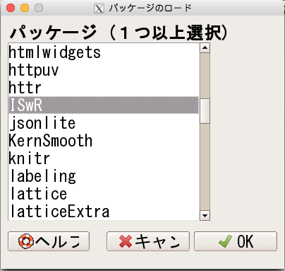

<style>
.midcenter {
    position: fixed;
    top: 50%;
    left: 50%;
}

/* slide titles */
.reveal h3 {
  font-size: 90px;
}
  border-width: 1px;
  border-spacing: 2px;
  border-style: line;
  border-color: gray;
  border-collapse: collapse;
  font-size: 0.85em;

.reveal table {}

/* heading for slides with two hashes ## */
.reveal .slides section .slideContent h2 {
   font-size: 50px;
   font-weight: bold;
}

/* ordered and unordered list styles */
.reveal ul,
.reveal ol {
    font-size: 40px;
    list-style-type: square;
}
.reveal big {
	font-size: 1.5em;
}
.reveal large {
  font-size: 2.0em;
}
.reveal small {
    font-style: 0.8em;
}
.gra {
    align-content: center;
    top: 20%;
    left: 10%;
}
</style>


公衆衛生学・疫学演習
========================================================
author: 
date: 
transition: fade
transition-speed: fast
font-import: http://fonts.googleapis.com/earlyaccess/notosansjapanese.css
width: 2000
height: 1000
css: solarized.css

<div class="gra">
<iframe src=' slides-figure/unnamed-chunk-1-1.html ' scrolling='no' frameBorder='0' seamless class='rChart dimple ' id=iframe- chart438962dc1b2e ></iframe> <style>iframe.rChart{ width: 100%; height: 400px;}</style>
</div>


本日の内容
========================================================

<br>
<br>
<br>
* <big>統計学の基本</big>
    + データの種類と要約のまとめ
    + 推定・検定
    + 信頼区間の理解
    + t 検定と$\chi^2$検定
       
***
<br>
<br>
<br>
* <big>臨床・疫学研究</big>
    + 診断検査法の研究
        + 感度・特異度・検査後確率
        + ROC曲線
    + 生存時間解析
    + メタアナリシス

* <big>RとEZRでデータ解析の実現</big>


記述統計学の復習
========================================================
<big>質的変数--数字で測れない</big>
* カテゴリへ分類できる変数
    + **順序ない**
        - 例：性別(男・女); 人種(黒人・白人・黄色人種)
    + **順序ある**
        - 例：１年生・２年生; 満足度(悪い・普通・良い)
* **表を作る**
    + 2重分割表

***

<big>量的変数--数字で測れる</big>
* ***原点0がある***
    + 例：身長(cm); 体重(kg); 年齢(歳)
* ***原点0がない***
    + 例：気温$^{\circ}C$; 日付(2010-1-1)
* ***要約統計量を求める***


要約統計量のまとめ
========================================================

1. 中心を表す量：
    + 平均値 (mean)；中央値(median)；最頻値(mode)

        <small>実演: library(ShinyIntroStats) -> intro_stats_shinyapps() [3]</small>

2. バラツキを表す量：
    + 標準偏差(sd)；四分位範囲(IQR)

3. **中央値**と**四分位範囲**のペア
    + 外れ値の影響を受けにくい
4. **平均値**と**標準偏差**
    + 外れ値がない場合に使う


推定と検定
========================================================
left:40%
<br>
* 推測統計学
    + 一部の**標本**(サンプル, sample)から**母集団**(population)について調べる(推測, inference)．
* 身長の例：  
測定値(観測値) $=$ 真の身長 $+$ 測定誤差:（モデル）
    + **180** $=$ **179.8** $+$ 0.2
    + **165** $=$ **164.5** $+$ 0.5
    + **170**  $=$ **169.7** $+$ 0.3
    + **X** $=$ **$\alpha$** $+$ $\epsilon$

***
<br>
* クラス全員の身長を測って(観測値)，このデータを使って，日本大学生の身長予測モデルを作る:
    + クラス全員の平均身長を日本大学生の平均身長として見積もる**(推定する)**．
    + クラス全員の平均身長と報告された日本大学生の平均身長と違いがあるかを**検定する(test)**．
    + 作った予測モデルを使って，ほかの大学から来た学生の身長を予想する: **予測**．
    + その予測には，**$\alpha$**がぴったり一致することはない，普通誤差があるため区間推定が必要．$\longrightarrow$ 95%**信頼区間**
    

95% 信頼区間　身長測定の例：
========================================================

<div class="midcenter" style="margin-left:-400px; margin-top:-350px;">

</div>

信頼区間に関する注意
========================================================
<br>
* **X** $=$ **$\alpha$** $+$ $\epsilon$
    + **$\alpha$**が95%の確率でこの区間に入る **$\bigtriangleup$**
    + 100回同じ実験を繰り返すと，95回の信頼区間には**$\alpha$**が含まれる．**$\bigcirc$**
* サンプルサイズ $\Uparrow$ $\longrightarrow$ 信頼区間の幅 $\Downarrow$

* リスク比やオッズ比など，95%信頼区間には **1** が含まれると，統計学的に有意ではない．

* 実演：`run shiny(confidence intervals)`


検定のコンセプト
========================================================
* 主張したいことを**対立仮節説H1**とする．
* その反対の否定したい仮説:**帰無仮説(null hypothesis)**を立てる．
    + たいていは否定されることを期待して立てられる。
    + 例えば、「コインを20回投げたとき回表18回が出たとしたらコインに歪みがないといえるか」という問題を考えた場合に，「コインに歪みがない」(表と裏が出る確率が等しい_p_ $=$ 0.5)という仮説にあたる．
* 仮説を棄却するかしないかを決める基準の確率を**有意水準**と定義される．(0.05)
    + この有意水準より小さい確率を持つことは，"稀に起こること"と判断し，該当の仮説は棄却される．
    + 例えば，「コインを20回投げたとき回表18回が出たとしたらコインに歪みがないといえるか」という問題を考えた場合に，帰無仮説が正しいなら，それが起きる確率は，$$p  = {18 \choose 20}(0.5)^{20} = 0.00018 < 0.05$$そのため，歪みがないという帰無仮説を棄却する．
    


データの種類によって統計解析手法が異なる
========================================================
<br>

|データ種類               |二値変数                          |連続変数                                        |生存期間                                    |
|:------------------------|:---------------------------------|:-----------------------------------------------|:-------------------------------------------|
|要約                     |分割表                            |ヒストグラム<br/>箱ひげ図<br/>散布図            |Kaplan-Meier 曲線                           |
|２群比較                 |Fisher 正確検定<br/>カイ二乗検定  |t 検定<br/>Man-Whitney U 検定                   |logrank検定<br/>一般化 Wilcoxon 検定        |
|対応のある２群比較       |McNemar 検定                      |対応のある t 検定<br/>Wilcoxon 符号付順位和検定 |                                            |
|３群以上の比較           |Fisher 正確検定 <br/>カイ二乗検定 |分散分析 (ANOVA)<br/>Kruskal-Wallis 検定        |logrank検定 <br/>一般化 Kruskal-Wallis 検定 |
|対応のある３群以上の比較 |Cochran R 検定                    |反復測定分散分析<br/>Friedman検定               |                                            |
|(多変量) 回帰分析        |ロジスティクス回帰                |単回帰・重回帰                                  |Cox比例ハザード回帰                         |


t 検定 (One sample)
========================================================

* 例：11名女性(30-49歳)に，毎日のエネルギー摂取を調査したところ，推奨の毎日エネルギー量2000 calの違いを検定する．

```r
daily.intake.kJ <- c(5260, 5470, 5640, 6180, 6390, 6515, 6805, 7515, 7515, 8230, 8770)

#毎日推奨エネルギー摂取量との違いを検定する
t.test(daily.intake.kJ*0.239, mu=2000)#Kj->Calの変換が必要
```

```

	One Sample t-test

data:  daily.intake.kJ * 0.239
t = -4.6886, df = 10, p-value = 0.0008563
alternative hypothesis: true mean is not equal to 2000
95 percent confidence interval:
 1430.737 1797.501
sample estimates:
mean of x 
 1614.119 
```

t 検定 (Two sample) 1
========================================================
<br>
* 例：22名女性の毎日エネルギー消費量(mJ)を測定したところ，肥満と痩せの２群の間に毎日エネルギー消費量は差があるかを検定する：
<br>
<iframe src=' slides-figure/unnamed-chunk-4-1.html ' scrolling='no' frameBorder='0' seamless class='rChart datatables ' id=iframe- chart43891fab6143 ></iframe> <style>iframe.rChart{ width: 100%; height: 400px;}</style>

t 検定 (Two samples) 2
========================================================
<br>

```r
library(ISwR);attach(energy)#データセットをローディング
t.test(expend ~ stature, var.equal=TRUE) # "~"の符号はstatureによりグループ分けの意味
```

```

	Two Sample t-test

data:  expend by stature
t = -3.9456, df = 20, p-value = 0.000799
alternative hypothesis: true difference in means is not equal to 0
95 percent confidence interval:
 -3.411451 -1.051796
sample estimates:
 mean in group lean mean in group obese 
           8.066154           10.297778 
```

```r
#差の95%信頼区間は0を含まれないため(p < 0.05)，肥満と痩せのエネルギー消費量は統計学的に有意な違いがある．
```


t 検定 (Two samples)  in EZR
========================================================

<div class="midcenter" style="margin-left:-900px; margin-top:-250px;">

</div>
<div class="midcenter" style="margin-left:-550px; margin-top:-250px;">

</div>

<div class="midcenter" style="margin-left:200px; margin-top:-250px;">

</div>

<div class="midcenter" style="margin-left:-300px; margin-top:120px;">

</div>

まとめたテーブルからt 検定 (Two samples) 
========================================================


```
   Sample Statin..No Statin..Yes
1  Number       6058        3049
2 Glucose   9.4(5.1)    9.2(5.3)
```

```r
require(lessR) #函数をローディング
tt.brief(n1 = 6058, m1 = 9.4, s1 = 5.1, n2 = 3049, m2 = 9.2, s2 = 5.3)
```

```

Compare Y across X levels Group1 and Group2 
------------------------------------------------------------

Y for X Group1:  n = 6058,  mean = 9.4,  sd = 5.1
Y for X Group2:  n = 3049,  mean = 9.2,  sd = 5.3

---
t-cutoff: tcut =  1.960 
Standard Error of Mean Difference: SE =  0.11 

Hypothesis Test of 0 Mean Diff:  t = 1.743,  df = 9105,  p-value = 0.081

Margin of Error for 95% Confidence Level:  0.22
95% Confidence Interval for Mean Difference:  -0.02 to 0.42

Sample Mean Difference of Y:  0.20
Standardized Mean Difference of Y, Cohen's d:  0.04
```


t 検定 (Paired two samples) 1
========================================================
<br>
* 例：11名の女性の月経前・後のエネルギー摂取量の違いがあるかを検定する 
<br>

<div class="gra">
<iframe src=' slides-figure/unnamed-chunk-7-1.html ' scrolling='no' frameBorder='0' seamless class='rChart datatables ' id=iframe- chart51163751195b ></iframe> <style>iframe.rChart{ width: 100%; height: 400px;}</style>
</div>

t 検定 (Paired two samples) 2
========================================================

```r
library(ISwR);attach(intake)#データセットをローディング
post-pre #月経後のエネルギー摂取は月経前より低い
```

```
 [1] -1350 -1250 -1755 -1020  -745 -1835 -1540 -1540  -725 -1330 -1435
```

```r
t.test(pre, post, paired = TRUE) #自分の対応があるので，pairをTRUEに指定
```

```

	Paired t-test

data:  pre and post
t = 11.941, df = 10, p-value = 0.0000003059
alternative hypothesis: true difference in means is not equal to 0
95 percent confidence interval:
 1074.072 1566.838
sample estimates:
mean of the differences 
               1320.455 
```

```r
#月経前後のエネルギーの差の95%信頼区間には，0が含まれていないので，統計学的に有意な違いがある．
```

t 検定 (Paired two samples) in EZR 1 
========================================================

<div class="midcenter" style="margin-left:-900px; margin-top:-250px;">

</div>
<div class="midcenter" style="margin-left:-550px; margin-top:-350px;">

</div>
<div class="midcenter" style="margin-left:-150px; margin-top:-350px;">

</div>
<div class="midcenter" style="margin-left: -150px; margin-top:-50px;">

</div>

t 検定 (Paired two samples) in EZR 2 
========================================================

<div class="midcenter" style="margin-left: -550px; margin-top:-300px;">

</div>

$$\chi^2検定 $$
========================================================
* $\chi^2$統計量の計算：$\chi^2 = \sum \frac{(O - E)^2}{E}$
* 例：胃潰瘍の薬AとBの治癒率に差があるかを検定する:

```r
M <- matrix(c(23, 7, 18, 13), 2 ,2)#データ入力
colnames(M) <- c("治癒","未治癒")#列の名前
rownames(M) <- c("薬A","薬B")#行の名前
addmargins(M)#観察値(O)
```

```
    治癒 未治癒 Sum
薬A   23     18  41
薬B    7     13  20
Sum   30     31  61
```

```r
addmargins(chisq.test(M)$expected)#期待値(E)
```

```
         治癒   未治癒 Sum
薬A 20.163934 20.83607  41
薬B  9.836066 10.16393  20
Sum 30.000000 31.00000  61
```

$$\chi^2検定 $$
========================================================

```r
chisq.test(M, correct = FALSE) #カイ二乗検定を行う
```

```

	Pearson's Chi-squared test

data:  M
X-squared = 2.394, df = 1, p-value = 0.1218
```

```r
E <- chisq.test(M)$expected#期待値
O <- chisq.test(M)$observed#観察値
(O - E)^2/E #カイ二乗統計量の計算
```

```
         治癒    未治癒
薬A 0.3988938 0.3860262
薬B 0.8177322 0.7913538
```

```r
0.3988938 + 0.3860262 + 0.8177322 + 0.7913538
```

```
[1] 2.394006
```

```r
#自由度(df) 1 のp値は0.05より大きいので，治癒率に差があると言えない．
```


診断検査法の研究
========================================================
<br>
<br>
* 感度(Sn)・特異度(Sp)の推定  
* 尤度比の推定
    + 陽性尤度比 (LR$+$):  
  LR$+$ $=$ Sn $\div$ (1 $-$ Sp)
    + 陰性尤度比 (LR$-$):  
  LR$-$ $=$ (1 $-$ Sn) $\div$ Sp
* 検査結果の使い方
    + 検査前オッズ $\times$ 尤度比 $=$ 検査後オッズ
* ROC曲線
    + 作成
    + 曲線下面積(AUC)の推定

<div class="midcenter" style="margin-left:-100px; margin-top:-250px;">

</div>

感度・特異度計算の例
========================================================

```r
library(RcmdrPlugin.EZR)
.Table <- matrix(c(36, 76, 15, 455), 2,2, byrow = T)
epi.tests(.Table, conf.level = 0.95)
```

```
              Disease positive Disease negative Total
Test positive               36               76   112
Test negative               15              455   470
Total                       51              531   582

 Point estimates and 95 % CIs:
---------------------------------------------------------
                                    Estimation Lower CI Upper CI
Apparent prevalence                      0.192    0.161    0.227
True prevalence                          0.088    0.066    0.114
Sensitivity                              0.706    0.562    0.825
Specificity                              0.857    0.824    0.886
Positive predictive value                0.321    0.236    0.416
Negative predictive value                0.968    0.948    0.982
Diagnstic accuracy                       0.844    0.812    0.872
Likelihood ratio of a positive test      4.932    3.752    6.482
Likelihood ratio of a negative test      0.343    0.224    0.526
---------------------------------------------------------
```

EZRでの操作
========================================================
<large>
①<br>

</large>

*** 
<large>
②<br>

</large>

検査後確率の計算
========================================================

* 検査前オッズ $\times$ **尤度比** $=$ 検査後オッズ

* 確率とオッズの変換:
    + 確率(Probability, p) vs. オッズ(Odds)  
    $$odds = \frac{p}{(1-p)}$$
    $$p = \frac{odds}{(1+odds)}$$

* 検査前確率: 
    + 普通は有病率(病気である確率)
    + 臨床現場により異なる
    + 先行研究に参考する
    
* (陽性)尤度比の計算: 
    $$LR+ = \frac{\frac{a}{a+c}}{\frac{b}{b+d}}$$ 

<div class="midcenter" style="margin-left:-100px; margin-top:-250px;">

</div>

ROC曲線とは
========================================================
left: 40%
<br>
* 検査のカットオフ値をたくさん作る;
* 小 $\rightarrow$ 大の順番に，それぞれの感度(Sn)・特異度(Sp)を算出する．
* **Snを$y$座標**に，**1 $-$ Spを$x$座標**にとったプロットしたグラフ．
* AUC(Area Under the roc Curve)曲線下面積が大きいほど良い検査法．

  <small>`実演：library(plotROC); shiny_plotROC()`</small>


***


ROC曲線をEZRで作成
========================================================


```r
set.seed(2529)
D.ex <- rbinom(200, size = 1, prob = .5)
M1 <- rnorm(200, mean = D.ex, sd = .65)
M2 <- rnorm(200, mean = D.ex, sd = 1.5)

test <- data.frame(D = D.ex, D.str = c("Healthy", "Ill")[D.ex + 1], 
                   M1 = M1, M2 = M2, stringsAsFactors = FALSE)
```

① ②


研究デザインのまとめ
========================================================
left:15%
***


エビデンスの信頼性
========================================================
<br>
<big>

|レベル |研究種類                                           |
|:------|:--------------------------------------------------|
|1a     |ランダム化比較試験のメタアナリシス                 |
|1b     |少なくとも一つのランダム化比較試験                 |
|2      |コホート研究（前向きが多い)                        |
|3      |ケース・コントロール研究（後ろ向きが多い)          |
|4      |処置前後の比較などの前後比較，対照群を伴わない研究 |
|5      |症例報告，ケースシリーズ                           |
|6      |専門家個人の意見（専門家委員会報告を含む）         |
</big>


例：薬とプラセボの治癒率の違いの定量化 1
========================================================
<br>
<big>

```
         治癒 未治癒 Sum
薬         23     18  41
プラセボ    7     13  20
Sum        30     31  61
```
</big>

* <big>**指標**</big>

* <big>リスク：割合</big>
    + 薬群リスク(治癒の割合): $p_1 = 23 \div 41 =$ 0.5609756
    + プラセボ群リスク(治癒の割合): $p_2 = 7 \div 20 =$ 0.35
* <big>リスク差: Risk Difference $=$ $p_1 - p_2 =$ 0.2109756</big> 


例：薬とプラセボの治癒率の違いの定量化 2
========================================================
<br>
<big>

```
         治癒 未治癒 Sum
薬         23     18  41
プラセボ    7     13  20
Sum        30     31  61
```
</big>
<br>

* <big>**指標**</big>
* <big>リスク比: Risk Ratio (RR) $=$ $p_1 \div p_2 =$ 1.6027875</big>  
* <big>オッズ比: Odds Ratio (OR) $= \frac{(23 \div 18)}{(7 \div 13)} = \frac{(23 \times 13)}{(7 \times 18)}　=$ 2.3730159</big>


例：薬とプラセボの治癒率の違いの定量化 3
========================================================
<br>
<big>

```
         治癒 未治癒 Sum
薬         23     18  41
プラセボ    7     13  20
Sum        30     31  61
```

```r
prop.diff.conf(23, 41, 7, 20, 95) #リスク差の点推定値と信頼区間
```

```
[1] Difference : 0.211
[1] 95% confidence interval : -0.047 - 0.469
```

```r
prop.ratio.conf(23, 41, 7, 20, 95) #リスク比の点推定値と信頼区間
```

```
[1] Ratio : 1.603
[1] 95% confidence interval : 0.832 - 3.088
```
</big>

例：薬とプラセボの治癒率の違いの定量化 4
========================================================
<br>
<big>

```
         治癒 未治癒 Sum
薬         23     18  41
プラセボ    7     13  20
Sum        30     31  61
```

```

	Fisher's Exact Test for Count Data

data:  M
p-value = 0.1737
alternative hypothesis: true odds ratio is not equal to 1
95 percent confidence interval:
 0.6936416 8.4948588
sample estimates:
odds ratio 
  2.339104 
```
</big>


相対危険度・寄与危険度
========================================================

<br>
<br>
* 曝露群が病気となるリスクは $\frac{a}{a + b}$
* 非曝露群のリスクは $\frac{c}{c + d}$
* **相対危険度 relative risk (RR)**は:  $\frac{\frac{a}{a + b}}{\frac{c}{c + d}}$ 
* **寄与危険度 attributable risk**は: 曝露群と非暴露群のリスクの差  $\frac{a}{a + b} - \frac{c}{c + d}$
* 曝露群の罹患率のうち，その曝露が原因となっている割合は**寄与危険度割合**:  
<br>
    $\frac{\frac{a}{a + b} - \frac{c}{c + d}}{\frac{a}{a + b}} = 1 - \frac{\frac{c}{c + d}}{\frac{a}{a + b}} = 1 - \frac{1}{RR} = \frac{RR - 1}{RR}$

<div class="midcenter" style="margin-left:-100px; margin-top:-250px;">

</div>


コホート研究-生存時間解析
========================================================

* 前向き研究であり，観察時間の経過とともにアウトカム(罹患・死亡)はどれくらい生じるか？
* その観測結果の定量化は，**生存曲線 Kaplan-Meier法**を使う．
    + 横軸に時間，縦軸に「まだアウトカムが起こっていない割合」をとった曲線．

<div class="midcenter" style="margin-left: -550px; margin-top:-200px;">

</div>


例：脳卒中死亡リスクのデータ
========================================================
<br>
<div class = "gra">
<iframe src=' slides-figure/unnamed-chunk-21-1.html ' scrolling='no' frameBorder='0' seamless class='rChart datatables ' id=iframe- chart43894d72c1ed ></iframe> <style>iframe.rChart{ width: 100%; height: 400px;}</style>
</div>


例：脳卒中死亡リスクのデータ-生存率の計算 
========================================================

```r
library(ISwR);library(survival);attach(stroke)#データセットをローディング
Surv.stroke <- survfit(Surv(obsmonths, dead) ~ 1)
summary(Surv.stroke)
```

```
Call: survfit(formula = Surv(obsmonths, dead) ~ 1)

    time n.risk n.event survival std.err lower 95% CI upper 95% CI
  0.0327    829      19    0.977 0.00520        0.967        0.987
  0.0654    810      23    0.949 0.00762        0.935        0.964
  0.0980    787      13    0.934 0.00864        0.917        0.951
  0.1000    774      25    0.903 0.01026        0.884        0.924
  0.1307    749       9    0.893 0.01075        0.872        0.914
  0.1634    740       7    0.884 0.01111        0.863        0.906
  0.1961    733      13    0.869 0.01174        0.846        0.892
  0.2288    720      13    0.853 0.01230        0.829        0.877
  0.2614    707      17    0.832 0.01297        0.807        0.858
  0.2941    690      13    0.817 0.01344        0.791        0.843
  0.3268    677      13    0.801 0.01387        0.774        0.829
  0.3595    664       8    0.791 0.01411        0.764        0.819
  0.3922    656      10    0.779 0.01440        0.752        0.808
  0.4248    646       8    0.770 0.01462        0.741        0.799
  0.4575    638       6    0.762 0.01478        0.734        0.792
  0.4902    632       4    0.758 0.01488        0.729        0.787
  0.5229    628       5    0.752 0.01501        0.723        0.782
  0.5556    623       2    0.749 0.01506        0.720        0.779
  0.5882    621       3    0.745 0.01513        0.716        0.776
  0.6209    618       1    0.744 0.01515        0.715        0.775
  0.6536    617       4    0.739 0.01524        0.710        0.770
  0.6863    613       5    0.733 0.01536        0.704        0.764
  0.7190    608       2    0.731 0.01540        0.701        0.762
  0.7516    606       4    0.726 0.01549        0.696        0.757
  0.7843    602       6    0.719 0.01561        0.689        0.750
  0.8170    596       6    0.712 0.01573        0.682        0.743
  0.8497    590       1    0.710 0.01575        0.680        0.742
  0.8824    589       4    0.706 0.01583        0.675        0.737
  0.9150    585       2    0.703 0.01587        0.673        0.735
  0.9477    583       1    0.702 0.01588        0.672        0.734
  0.9804    582       3    0.698 0.01594        0.668        0.730
  1.0131    579       1    0.697 0.01596        0.667        0.729
  1.0458    578       1    0.696 0.01598        0.665        0.728
  1.0784    577       4    0.691 0.01605        0.660        0.723
  1.1111    573       4    0.686 0.01611        0.656        0.719
  1.1765    569       3    0.683 0.01616        0.652        0.715
  1.2418    566       3    0.679 0.01621        0.648        0.712
  1.2745    563       3    0.676 0.01626        0.644        0.708
  1.3072    560       3    0.672 0.01631        0.641        0.705
  1.3399    557       2    0.669 0.01634        0.638        0.702
  1.3725    555       2    0.667 0.01637        0.636        0.700
  1.4052    553       1    0.666 0.01638        0.635        0.699
  1.4379    552       2    0.663 0.01641        0.632        0.696
  1.5686    550       2    0.661 0.01644        0.630        0.694
  1.6340    548       3    0.657 0.01648        0.626        0.691
  1.6667    545       3    0.654 0.01652        0.622        0.687
  1.7320    542       1    0.653 0.01654        0.621        0.686
  1.7974    541       1    0.651 0.01655        0.620        0.685
  1.9281    540       1    0.650 0.01656        0.619        0.683
  1.9608    539       1    0.649 0.01658        0.617        0.682
  2.0915    538       1    0.648 0.01659        0.616        0.681
  2.1569    537       1    0.647 0.01660        0.615        0.680
  2.1895    536       1    0.645 0.01662        0.614        0.679
  2.2222    535       2    0.643 0.01664        0.611        0.676
  2.2549    533       1    0.642 0.01665        0.610        0.675
  2.3203    532       1    0.641 0.01667        0.609        0.674
  2.3856    531       1    0.639 0.01668        0.607        0.673
  2.4510    530       1    0.638 0.01669        0.606        0.672
  2.4837    529       1    0.637 0.01670        0.605        0.671
  2.5163    528       1    0.636 0.01671        0.604        0.669
  2.5817    527       2    0.633 0.01674        0.601        0.667
  2.7451    525       1    0.632 0.01675        0.600        0.666
  2.7778    524       2    0.630 0.01677        0.598        0.663
  2.8105    522       1    0.628 0.01678        0.596        0.662
  2.8431    521       1    0.627 0.01679        0.595        0.661
  2.8758    520       1    0.626 0.01680        0.594        0.660
  2.9085    519       2    0.624 0.01683        0.592        0.658
  3.0719    517       1    0.622 0.01684        0.590        0.656
  3.1046    516       1    0.621 0.01685        0.589        0.655
  3.3007    515       1    0.620 0.01686        0.588        0.654
  3.3333    514       2    0.618 0.01688        0.585        0.652
  3.4641    512       1    0.616 0.01689        0.584        0.650
  3.6275    511       1    0.615 0.01690        0.583        0.649
  3.7582    510       1    0.614 0.01691        0.582        0.648
  3.8562    509       1    0.613 0.01692        0.581        0.647
  3.9216    508       2    0.610 0.01694        0.578        0.644
  3.9542    506       2    0.608 0.01696        0.576        0.642
  4.0196    504       1    0.607 0.01697        0.574        0.641
  4.2157    503       1    0.606 0.01697        0.573        0.640
  4.2810    502       1    0.604 0.01698        0.572        0.639
  4.3464    501       1    0.603 0.01699        0.571        0.637
  4.3791    500       1    0.602 0.01700        0.570        0.636
  4.6078    499       2    0.600 0.01702        0.567        0.634
  4.6405    497       2    0.597 0.01704        0.565        0.631
  4.6732    495       1    0.596 0.01704        0.563        0.630
  4.7059    494       2    0.593 0.01706        0.561        0.628
  4.7386    492       1    0.592 0.01707        0.560        0.627
  4.8039    491       1    0.591 0.01708        0.559        0.626
  4.9346    490       1    0.590 0.01708        0.557        0.624
  5.0654    489       1    0.589 0.01709        0.556        0.623
  5.5229    488       1    0.587 0.01710        0.555        0.622
  5.5556    487       1    0.586 0.01711        0.554        0.621
  5.5882    486       1    0.585 0.01711        0.552        0.620
  5.6209    485       1    0.584 0.01712        0.551        0.618
  5.6536    484       1    0.583 0.01713        0.550        0.617
  6.0131    483       1    0.581 0.01713        0.549        0.616
  6.0458    482       1    0.580 0.01714        0.548        0.615
  6.1765    481       1    0.579 0.01715        0.546        0.614
  6.4379    480       1    0.578 0.01715        0.545        0.612
  6.4706    479       1    0.577 0.01716        0.544        0.611
  6.6013    478       1    0.575 0.01717        0.543        0.610
  6.6340    477       1    0.574 0.01717        0.541        0.609
  7.0915    476       1    0.573 0.01718        0.540        0.608
  7.2222    475       3    0.569 0.01720        0.537        0.604
  7.2549    472       1    0.568 0.01720        0.535        0.603
  7.3203    471       2    0.566 0.01721        0.533        0.601
  7.4837    469       1    0.565 0.01722        0.532        0.599
  7.5490    468       1    0.563 0.01723        0.531        0.598
  7.6144    467       2    0.561 0.01724        0.528        0.596
  7.7451    465       1    0.560 0.01724        0.527        0.595
  8.0719    464       1    0.559 0.01725        0.526        0.593
  8.4967    463       1    0.557 0.01725        0.524        0.592
  8.5294    462       1    0.556 0.01726        0.523        0.591
  9.0196    461       1    0.555 0.01726        0.522        0.590
  9.3464    460       1    0.554 0.01727        0.521        0.589
  9.5098    459       2    0.551 0.01727        0.518        0.586
  9.9346    457       1    0.550 0.01728        0.517        0.585
 10.0980    456       1    0.549 0.01728        0.516        0.584
 10.1961    455       1    0.548 0.01729        0.515        0.583
 10.2614    454       1    0.546 0.01729        0.514        0.581
 10.2941    453       1    0.545 0.01729        0.512        0.580
 10.4575    452       1    0.544 0.01730        0.511        0.579
 10.8497    451       1    0.543 0.01730        0.510        0.578
 10.8824    450       1    0.542 0.01731        0.509        0.577
 11.2418    449       1    0.540 0.01731        0.508        0.575
 11.3725    448       1    0.539 0.01731        0.506        0.574
 11.8301    447       1    0.538 0.01732        0.505        0.573
 12.8105    446       1    0.537 0.01732        0.504        0.572
 12.9085    445       1    0.536 0.01732        0.503        0.571
 13.1046    444       1    0.534 0.01732        0.501        0.569
 13.2353    443       1    0.533 0.01733        0.500        0.568
 13.3660    442       1    0.532 0.01733        0.499        0.567
 13.5621    441       1    0.531 0.01733        0.498        0.566
 13.6275    440       1    0.530 0.01734        0.497        0.565
 13.8889    439       1    0.528 0.01734        0.495        0.563
 13.9542    438       1    0.527 0.01734        0.494        0.562
 13.9869    437       1    0.526 0.01734        0.493        0.561
 14.9673    436       1    0.525 0.01734        0.492        0.560
 15.6863    435       1    0.524 0.01735        0.491        0.559
 15.7190    434       1    0.522 0.01735        0.489        0.557
 15.9150    433       2    0.520 0.01735        0.487        0.555
 15.9477    431       1    0.519 0.01735        0.486        0.554
 15.9804    430       1    0.517 0.01736        0.485        0.553
 16.0131    429       1    0.516 0.01736        0.483        0.551
 16.2745    428       1    0.515 0.01736        0.482        0.550
 16.3725    427       1    0.514 0.01736        0.481        0.549
 17.0261    426       2    0.511 0.01736        0.479        0.547
 18.0392    424       1    0.510 0.01736        0.477        0.545
 18.2353    423       1    0.509 0.01736        0.476        0.544
 18.5621    422       1    0.508 0.01736        0.475        0.543
 18.6275    421       1    0.507 0.01736        0.474        0.542
 18.9542    420       1    0.505 0.01736        0.473        0.541
 19.6732    419       1    0.504 0.01737        0.471        0.539
 19.7059    418       1    0.503 0.01737        0.470        0.538
 19.9020    417       1    0.502 0.01737        0.469        0.537
 20.0000    416       1    0.501 0.01737        0.468        0.536
 20.0327    415       1    0.499 0.01737        0.466        0.535
 20.3268    414       1    0.498 0.01737        0.465        0.533
 20.3922    413       1    0.497 0.01737        0.464        0.532
 20.5556    412       1    0.496 0.01737        0.463        0.531
 20.8497    411       1    0.495 0.01736        0.462        0.530
 21.4379    410       1    0.493 0.01736        0.460        0.529
 21.6667    409       1    0.492 0.01736        0.459        0.527
 21.6993    408       1    0.491 0.01736        0.458        0.526
 21.9608    407       1    0.490 0.01736        0.457        0.525
 22.1569    406       1    0.489 0.01736        0.456        0.524
 22.4510    405       1    0.487 0.01736        0.454        0.523
 22.4837    404       1    0.486 0.01736        0.453        0.521
 23.5948    403       1    0.485 0.01736        0.452        0.520
 23.6275    402       1    0.484 0.01736        0.451        0.519
 23.6601    401       1    0.483 0.01736        0.450        0.518
 24.1830    396       1    0.481 0.01735        0.448        0.517
 24.2157    395       1    0.480 0.01735        0.447        0.515
 24.3137    391       1    0.479 0.01735        0.446        0.514
 24.3464    390       1    0.478 0.01735        0.445        0.513
 24.4444    388       1    0.476 0.01735        0.444        0.512
 24.5098    385       1    0.475 0.01735        0.442        0.510
 24.6405    382       1    0.474 0.01735        0.441        0.509
 24.6732    381       1    0.473 0.01735        0.440        0.508
 24.9020    379       1    0.471 0.01735        0.439        0.507
 25.0327    376       1    0.470 0.01734        0.437        0.505
 25.1961    373       1    0.469 0.01734        0.436        0.504
 25.7843    366       1    0.468 0.01734        0.435        0.503
 26.4379    355       1    0.466 0.01735        0.434        0.502
 26.5359    352       1    0.465 0.01735        0.432        0.500
 26.6013    351       1    0.464 0.01735        0.431        0.499
 27.5163    340       1    0.462 0.01735        0.430        0.498
 27.8758    337       1    0.461 0.01735        0.428        0.496
 27.9085    333       1    0.460 0.01736        0.427        0.495
 28.1046    331       1    0.458 0.01736        0.425        0.493
 28.1373    330       1    0.457 0.01736        0.424        0.492
 29.1503    312       1    0.455 0.01737        0.422        0.491
 29.3137    309       1    0.454 0.01737        0.421        0.489
 29.7059    303       1    0.452 0.01738        0.420        0.488
 29.7712    301       1    0.451 0.01739        0.418        0.486
 30.4248    295       1    0.449 0.01740        0.416        0.485
 30.7516    289       1    0.448 0.01740        0.415        0.483
 31.8627    275       2    0.444 0.01743        0.412        0.480
 32.8105    265       1    0.443 0.01744        0.410        0.478
 32.9739    264       1    0.441 0.01746        0.408        0.477
 33.2026    261       1    0.439 0.01747        0.406        0.475
 33.3007    259       1    0.438 0.01749        0.405        0.473
 33.3333    258       1    0.436 0.01750        0.403        0.472
 33.6601    255       1    0.434 0.01752        0.401        0.470
 34.3791    248       1    0.433 0.01753        0.400        0.468
 34.5098    245       1    0.431 0.01755        0.398        0.467
 34.7059    240       1    0.429 0.01757        0.396        0.465
 35.1634    232       1    0.427 0.01759        0.394        0.463
 35.9150    222       1    0.425 0.01762        0.392        0.461
 35.9804    221       1    0.423 0.01764        0.390        0.459
 36.4379    214       1    0.421 0.01767        0.388        0.457
 37.4510    201       1    0.419 0.01771        0.386        0.455
 38.4641    193       1    0.417 0.01775        0.384        0.453
 38.7908    188       1    0.415 0.01779        0.381        0.451
 39.8039    180       1    0.413 0.01784        0.379        0.449
 39.8693    178       1    0.410 0.01789        0.377        0.447
 41.3399    163       1    0.408 0.01796        0.374        0.444
 42.5490    154       1    0.405 0.01803        0.371        0.442
 42.8431    152       1    0.402 0.01811        0.368        0.440
 43.6275    135       1    0.399 0.01822        0.365        0.437
 47.1242    104       1    0.396 0.01845        0.361        0.433
 49.2810     86       1    0.391 0.01880        0.356        0.430
 51.1765     68       1    0.385 0.01938        0.349        0.425
 51.2092     67       1    0.379 0.01992        0.342        0.421
 51.8954     61       1    0.373 0.02055        0.335        0.416
 53.6601     47       1    0.365 0.02159        0.325        0.410
```

例：脳卒中死亡リスクのデータ-生存曲線 
========================================================


例：脳卒中死亡リスクのデータ-生存曲線男女別 
========================================================
<br>


例：生存曲線の比較検定 logrank 検定
========================================================
<br>
<big>

```r
library(survival)
survdiff(Surv(obsmonths, dead) ~ sex) #logrank検定の函数
```

```
Call:
survdiff(formula = Surv(obsmonths, dead) ~ sex)

             N Observed Expected (O-E)^2/E (O-E)^2/V
sex=Female 510      321      280      6.11      14.6
sex=Male   319      164      205      8.32      14.6

 Chisq= 14.6  on 1 degrees of freedom, p= 0.000132 
```
</big>


メタアナリシス (meta-analysis)
========================================================
<br>

* <big>系統的レビュー(systematic review)の一部: </big>

    + <big>ある臨床疑問に対して，今まで行われた**すべて**のエビデンスを収集し</big>
    + <big>その中で，**妥当**なものを選んで，統計学的な手法を利用して，一つの結論(数値)にまとめたもの．</big>


例：メタアナリシス (meta-analysis) 1
========================================================
<br>
<br>
<big>
チフスに対する新しいワクチンを開発し，いくつかの異なる集団において，同じワクチンの有効性を検査して，メタ解析を行う．</big>

<iframe src=' slides-figure/unnamed-chunk-26-1.html ' scrolling='no' frameBorder='0' seamless class='rChart datatables ' id=iframe- chart43894ef34c1b ></iframe> <style>iframe.rChart{ width: 100%; height: 400px;}</style>

例：メタアナリシス・検定結果 2
========================================================
<br>

```
                       OR            95%-CI %W(fixed) %W(random)
HospitalSA         2.8571 [0.6011; 13.5804]       0.9        2.1
GarrisonLadysmith  0.9572 [0.4308;  2.1269]       4.9        7.4
SpecialRegimenSA   2.4098 [1.0233;  5.6753]       2.9        6.5
SpecialHospitalSA  1.5285 [1.2059;  1.9374]      50.1       39.1
MilitaryHospitalSA 1.9814 [1.5058;  2.6072]      35.2       34.3
IndianArmy         2.6684 [1.4016;  5.0803]       6.0       10.7

Number of studies combined: k = 6

                         OR           95%-CI    z  p-value
Fixed effect model   1.7659 [1.4979; 2.0820] 6.77 < 0.0001
Random effects model 1.7877 [1.4212; 2.2486] 4.96 < 0.0001

Quantifying heterogeneity:
tau^2 = 0.0204; H = 1.17 [1.00; 1.81]; I^2 = 26.6% [0.0%; 69.5%]

Test of heterogeneity:
    Q d.f.  p-value
 6.81    5   0.2350

Details on meta-analytical method:
- Mantel-Haenszel method
- DerSimonian-Laird estimator for tau^2
```

例：メタアナリシス・Forest-plot 3
========================================================

<div class="midcenter" style="margin-left: -900px; margin-top:-350px;">

</div>


例：メタアナリシス・Funnel-plot 4
========================================================
<div class="midcenter" style="margin-left: -700px; margin-top:-350px;">

</div>

例：メタアナリシス・出版バイアス 5
========================================================
<br>
<big>

```r
metabias(res, k.min = 5)
```

```

	Linear regression test of funnel plot asymmetry (efficient score)

data:  res
t = 0.51543, df = 4, p-value = 0.6334
alternative hypothesis: asymmetry in funnel plot
sample estimates:
     bias   se.bias     slope 
0.4428032 0.8590997 0.4306045 
```
</big>


例：メタアナリシスをEZRで実現_datainput 1
========================================================

<div class="midcenter" style="margin-left: -900px; margin-top:-350px;">

</div>
<div class="midcenter" style="margin-left: 30px; margin-top:-350px;">

</div>


例：メタアナリシスをEZRで実現_datainput 2
========================================================
<div class="midcenter" style="margin-left: -900px; margin-top: 0px;">

</div>

<div class="midcenter" style="margin-left: -100px; margin-top: -350px;">

</div>


例：メタアナリシスをEZRで実現_解析操作 1
========================================================
<div class="midcenter" style="margin-left: -900px; margin-top: 0px;">

</div>

<div class="midcenter" style="margin-left: -100px; margin-top: -400px;">

</div>

例：メタアナリシスをEZRで実現_解析操作 2
========================================================
<div class="midcenter" style="margin-left: -400px; margin-top: -400px;">

</div>


最後に
========================================================
<div class="midcenter" style="margin-left: -900px; margin-top: -400px;">

</div>


本講義中使用したデモデータを導入 1
========================================================
<div class="midcenter" style="margin-left: -900px; margin-top: -400px;">

</div>


本講義中使用したデモデータの導入 2
========================================================
<div class="midcenter" style="margin-left: -700px; margin-top: -400px;">

</div>

本講義中使用したデモデータの導入 3
========================================================
<div class="midcenter" style="margin-left: -700px; margin-top: -400px;">

</div>

本講義中使用したデモデータの導入 4
========================================================
<div class="midcenter" style="margin-left: -900px; margin-top: 0px;">

</div>

<div class="midcenter" style="margin-left: -100px; margin-top: -400px;">

</div>


本講義中使用したデモデータの導入 5
========================================================
<div class="midcenter" style="margin-left: -400px; margin-top: -400px;">

</div>


本講義中使用したデモデータの導入 6
========================================================
<div class="midcenter" style="margin-left: -900px; margin-top: -300px;">

</div>

<div class="midcenter" style="margin-left: 0px; margin-top: -300px;">

</div>

本当に最後です！
========================================================
<br>
<br>
<br>
<large>講義のスライド欲しい！</large>

<big>アドレスはこちら：[http://winterwang.github.io/Epi_exercise/slides.html#/](http://winterwang.github.io/Epi_exercise/slides.html#/)</big>

<large>スライドと解析のプログラム欲しい！</large>

<big>アドレスはこちら:[https://github.com/winterwang/Epi_exercise](https://github.com/winterwang/Epi_exercise)</big>

<br>
<br>
<large>課題頑張ってください！</large>
